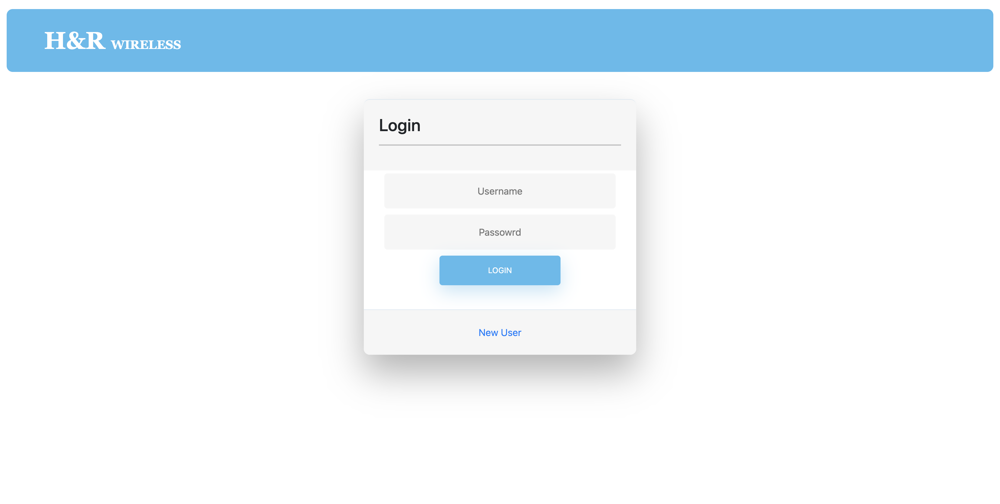
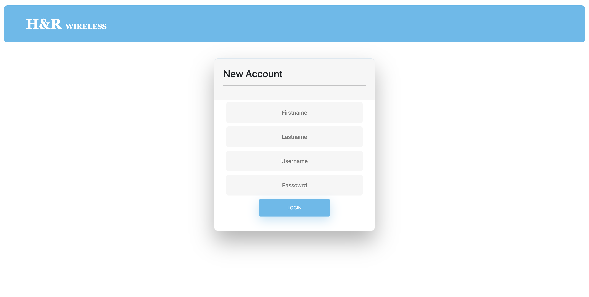
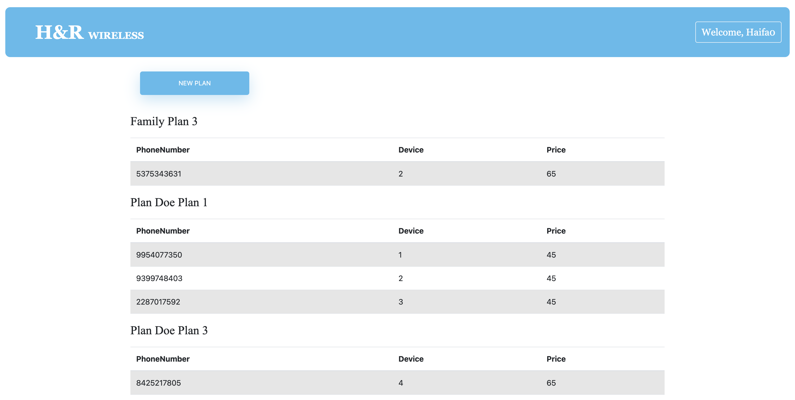
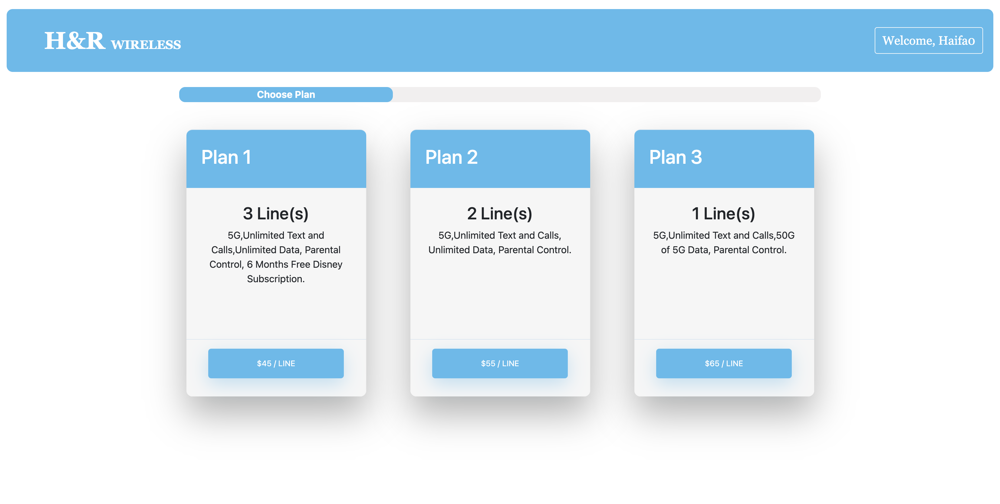
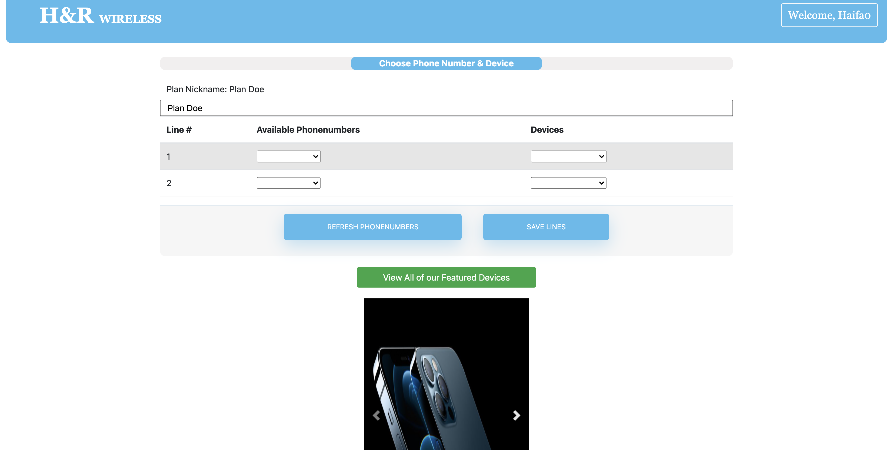

# H&R Wireless

In this project we Create Application to `login user` and `create new account` to choose `plan` or more, `Lines` and `Devices`.

The Username is unique to keep every user own his/her account, there are many options for plans and more.

We used in the project `Spring` and `Angular` to provide the Application.

- As `Database` we used `MySQL`. 

- In Back end we used `Spring Boot ` : 
    * `Repository` to interact with the database.
    * `Service` to make businees logic.
    * `Controller` To receive the Http requests and forward it to the proper method in the service.

- In Front end we used `Angular` fram work:
    * Components are a subset of directives, always associated with a template.
    * Services to share information among classes that don't know each other.

During these processes we `Deployed` our Application using `Azure` App service for `Spring` and `Angular` in separates files.

In `Azure Pipeline` we bind it with a private Repository on gitHub to deploy it as `CI/CD` deployment.

## App Service Application URL : [https://hrwireless.azurewebsites.net/]().

 
 

